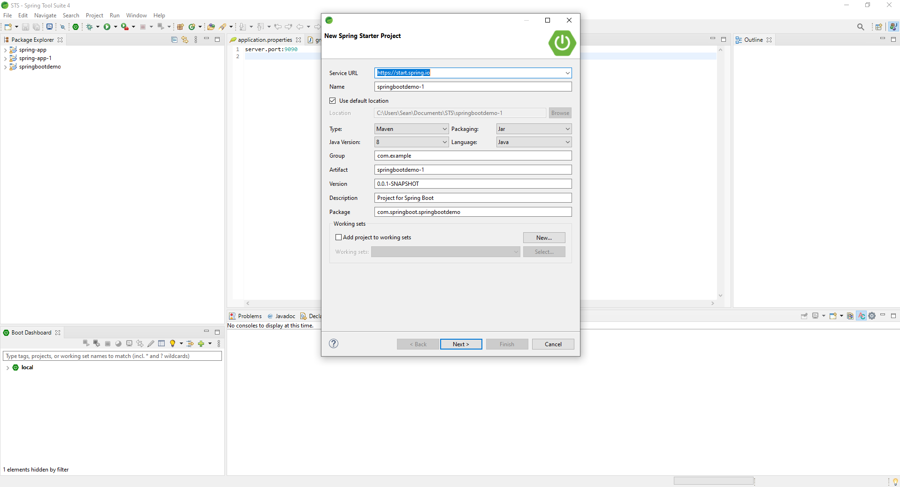
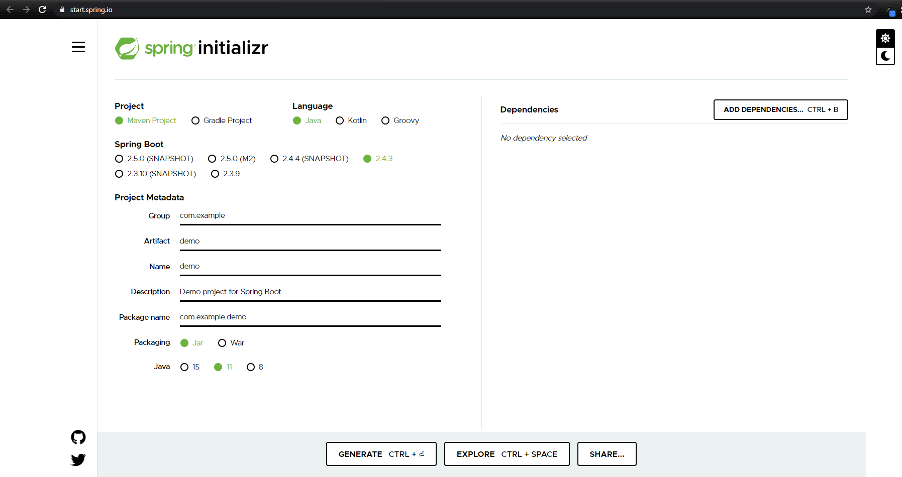

# Spring Tool Suite 4 - Basic Hello World

Using the Spring Tool Suite 4 IDE and Eclipse

## Spring Boot on Spring Tool Suite 4(STS4)

1. Download Spring Tool Suite 4 (JAR) on https://spring.io/tools
2. Place and paste the jar in your chosen directory 
3. Open the extracted File > Spring Application 
4. Choose your directory for the project
5. Once open go to File> New > Spring Starter Project
6. Fill the app name > Next > Add Dependencies (if needed) > WEB/MySQL/Spring Data JPA

8. Under the "src/main/java" create a class SBController.java
9. Paste this :

          package com.springboot.springapp;
          import org.springframework.stereotype.Controller;
          import org.springframework.web.bind.annotation.ResponseBody;
          import org.springframework.web.bind.annotation.RequestMapping;

          @Controller
          public class SBController {
            @RequestMapping("/")
            public @ResponseBody String greeting()
            {
              return "Hello World";
            }
          }

9. Click Run and Go to browser localhost:8080

If error occured like : 
failed to configure a datasource: 'url' attribute is not specified and no embedded datasource could be configured.

Go to pox.xml and comment the dependency starter data jpa 

## Create Spring boot in Eclipse 

  1.Install Java JDK  

  2.Install Eclipse 

  3.Go to https://start.spring.io/

      Project : Maven
      Langgauge : Java
      Spring boot : 2.4.3
      Group.com.springboot
      Artifact/Name: SBDemo
      
   
      
      
  4. Select Dependencies : Web dependecies > Export > Extract on your chosen folder
  
  5. Eclipse > File > import >Exixting Maven Proj > Select File
  
  6. Create a class file under src/main/java > SBController.java
  
  7. Paste this :

              package com.springboot.sbdemo;
              import org.springframework.stereotype.Controller;
              import org.springframework.web.bind.annotation.ResponseBody;
              import org.springframework.web.bind.annotation.RequestMapping;

              @Controller
              public class SBController {

                @RequestMapping("/")
                public @ResponseBody String greeting()
                {
                  return "Hello World";
                }

              }

  6. Run on main class
  7. Go to localhost:8080 (Tomcat)

